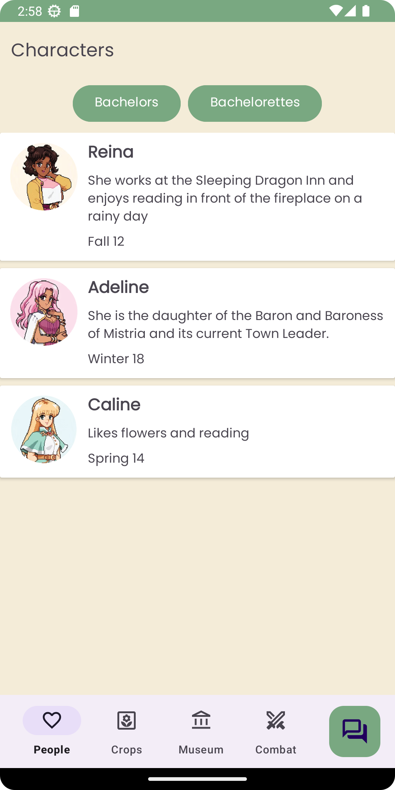
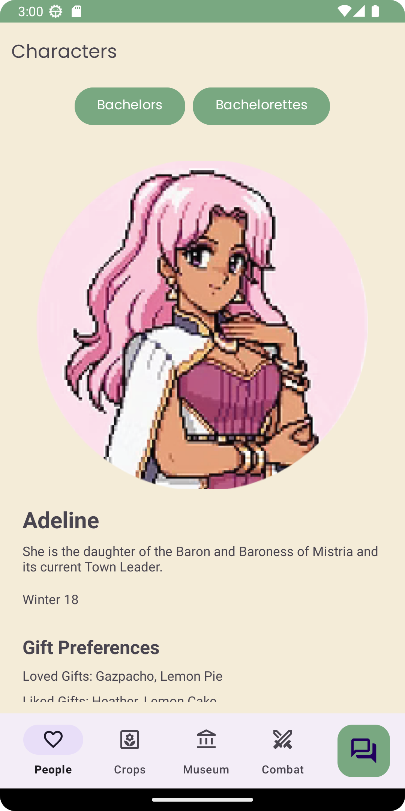
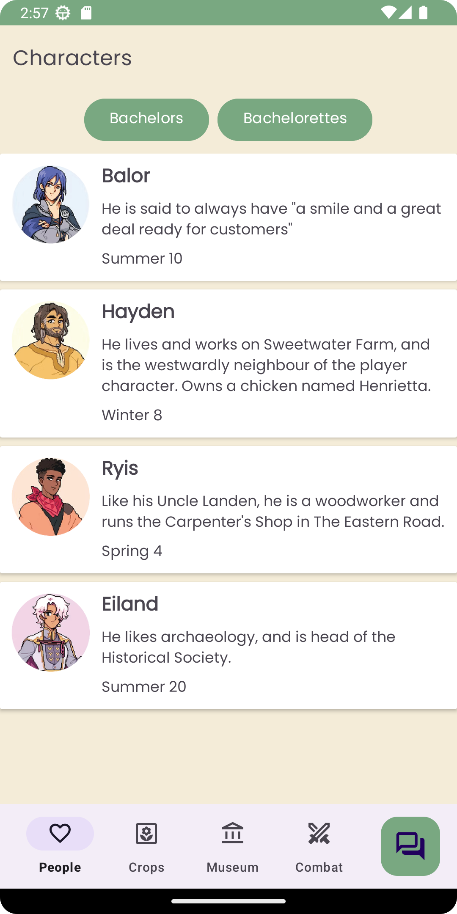
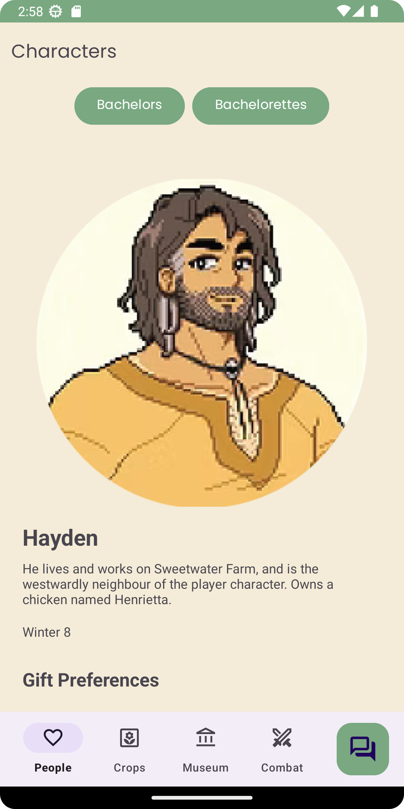
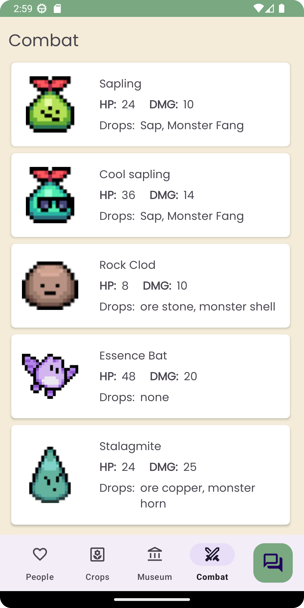
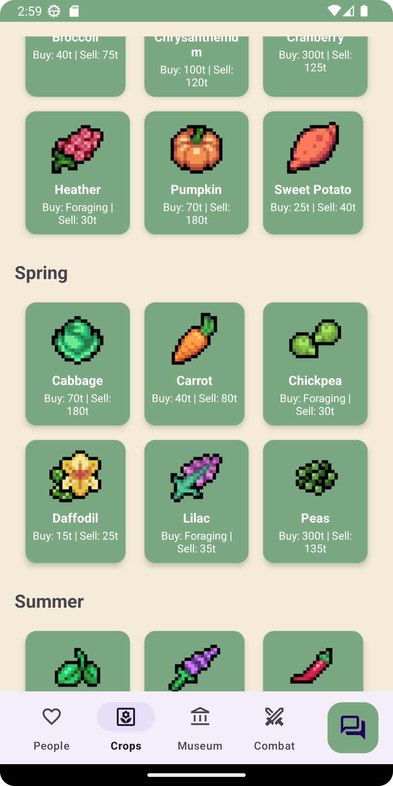
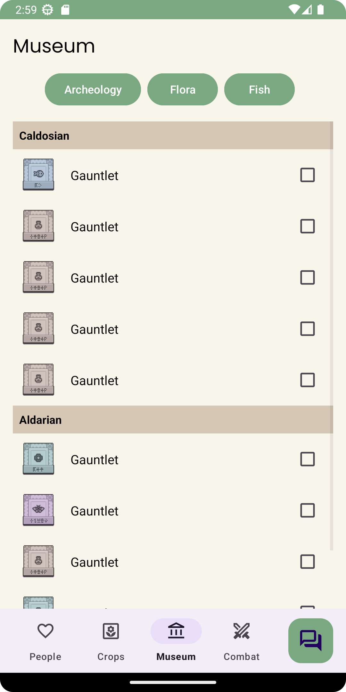
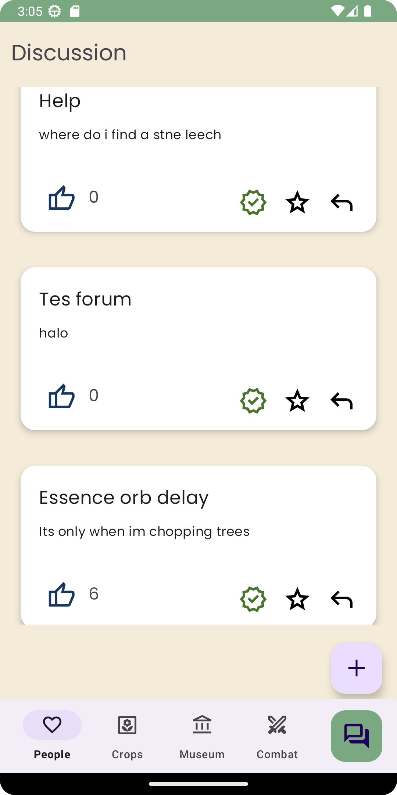

# FoM Android Mobile Guide
This is an android-based mobile app game guide made for the indie game "Fields of Mistria"!
I used Android studio jellyfish (Java) as the IDE and Firebase Firestore as the real time database.

Here is the preview of the app

## Bachelorettes Page

## Bachelorettes Details

## Bachelors

## Bachelors Details

## Combats

## Crops

## Museum

## Forum

